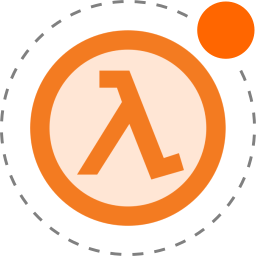

# luambda

[!! UNDER CONSTRUCTION !!]

"luambda" is a project which enables Lua scripting in GoldSource engine based games. (e.g. Half-Life, Counter Strike, Day of Defeat)

<p align="center">
    
</p>

[!! UNDER CONSTRUCTION !!]

## Motivation

For (Gold)Source engine based games, Pawn has been the *de facto* mod language. Pawn is good enough (compact, fast etc.) but there are some language flaws which I personally dislike. So I would just like to bring Lua, a language which perhaps all game devs are familiar with, into GoldSource mod.

## Building

Powered by [xmake](https://xmake.io/), all external dependencies (`gtest`, `swig`, etc.) will be auto-resolved.

### Linux

* With `xmake` installed, you can directly build the project by running

  ```
  xmake f -a i386 -m debug
  xmake
  ```

* Or we have already prepared a Docker for compiling

  ```
  # Set up Docker
  ## You can add these lines to your shell start-up script
  export UID="$(id -u)"
  export GID="$(id -g)"

  ## This may take a while
  docker-compose up -d
  docker-compose exec compiler bash

  # Entering a Docker shell
  cd /comp
  xmake f -a i386 -m debug --ccache=n -c
  xmake
  ```

### Windows

TO-DO: ...

## Usage

### A quick example

[tests/scripts/test.lua](tests/scripts/test.lua):

```lua
-- it should be invalid
local pl = luambda.player.find_by_index(1)
print(pl:is_valid())

-- a hook example
luambda.register_hook("client_connect", function(player, name, ip)
    player:print_console(string.format("Player %s is connecting from %s.", name, ip))
    print("[LUA] Player " .. name .. " is connecting from " .. ip .. ".")
end)
```

### Documentation

TO-DO: ...
